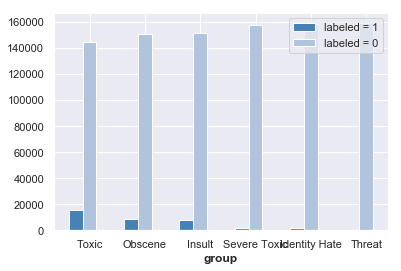
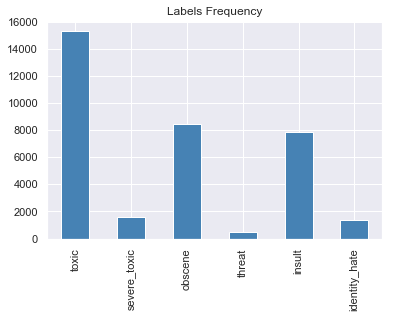
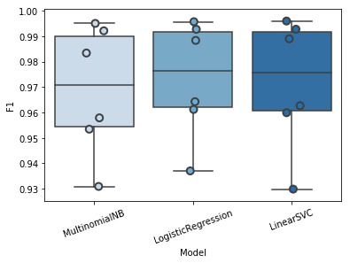
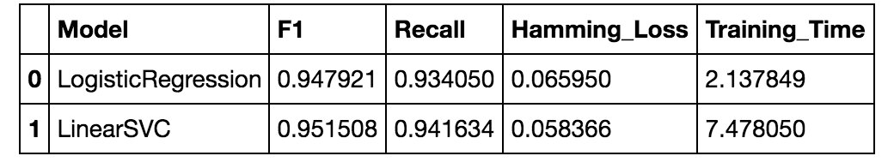
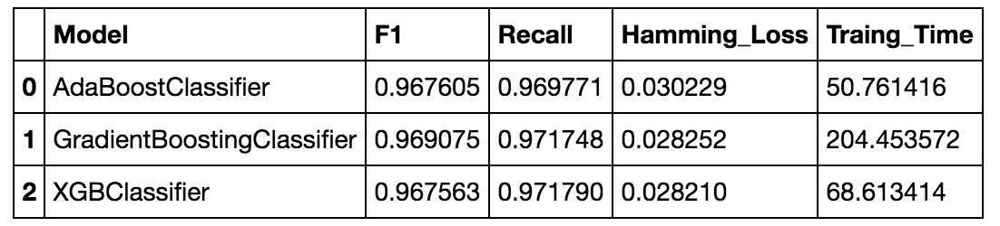
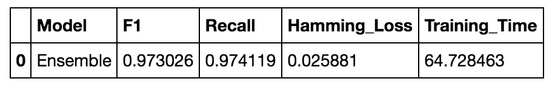
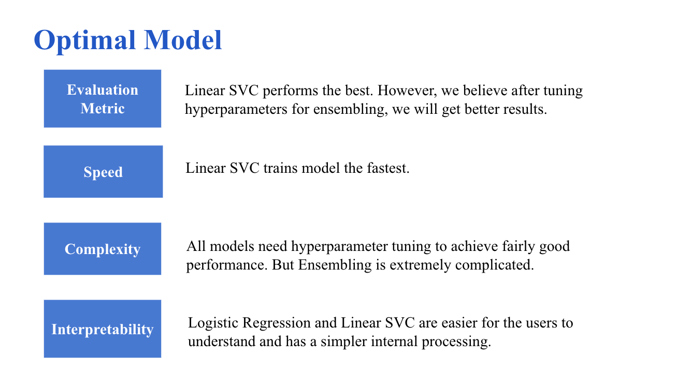
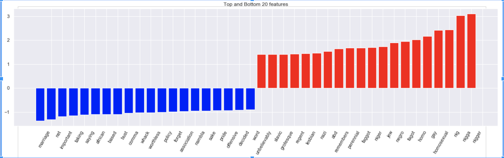

# Toxic Comment Classification

An NLP and machine-learning project for identifying toxic content in online comments. The classifier predicts six toxicity categories: `toxic`, `severe_toxic`, `obscene`, `threat`, `insult`, and `identity_hate`.


## Table of Contents

- [Dataset](#dataset)
- [Approach](#approach)
- [Results](#results)
- [Project Structure](#project-structure)
- [Getting Started](#getting-started)
- [Acknowledgments](#acknowledgments)

## Dataset

This project uses the [Jigsaw Toxic Comment Classification Challenge](https://www.kaggle.com/c/jigsaw-toxic-comment-classification-challenge) dataset. It contains Wikipedia talk-page comments labelled for different types of toxic behaviour.

The target labels are:

- `toxic`
- `severe_toxic`
- `obscene`
- `threat`
- `insult`
- `identity_hate`




## Approach

The workflow includes:

1. Cleaning and preprocessing comment text.
2. Converting text into numerical features using TF-IDF and Count Vectorization.
3. Training and comparing multiple classifiers, including Multinomial Naive Bayes, Logistic Regression, and Linear SVC.
4. Addressing class imbalance and evaluating models using F1 score, recall, and Hamming loss.
5. Exploring ensemble methods to improve classification performance.

### Model comparison



### Pipeline and hyperparameter tuning




### Ensemble model



## Results

Linear SVC performed strongly among the individual models. The project also evaluates an ensemble approach to improve overall classification performance.



### Feature analysis



## Project Structure

```text
toxic-comment-classifier/
├── README.md
├── main.py
├── Toxic_Comment_Classification.ipynb
├── data/
└── images/
    ├── img1.png
    ├── img2.png
    ├── img3.png
    ├── img4.png
    ├── img5.png
    ├── img6.png
    ├── img7.png
    └── img8.png
```

## Getting Started

1. Clone or download this repository.
2. Install the Python packages required by `main.py` and the notebook.
3. Download the competition data from Kaggle and place it in the `data/` folder.
4. Run the notebook or execute `main.py` to train and evaluate the models.

## Acknowledgments

- Dataset: [Jigsaw Toxic Comment Classification Challenge](https://www.kaggle.com/c/jigsaw-toxic-comment-classification-challenge), created in collaboration with Conversation AI, Jigsaw, and Google.
- This repository should retain appropriate credit for any code, analysis, charts, or documentation adapted from external collaborators or sources.
